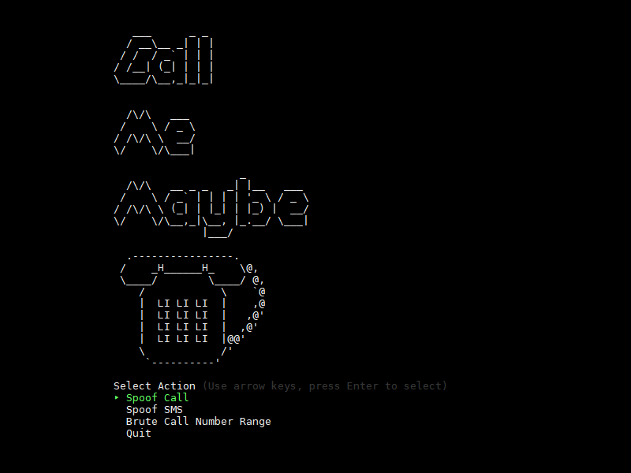

# Call Me Maybe
> Social Engineering Attack Suite for the Telephone Network (integrated with Plivo).

The initial features this tool allows is: Spoofing Phone Calls, Spoofing SMS, Brute Force Dialling of Phone Number Ranges (to detect valid phone company numbers/extensions and record audio)



## Requirements

Ruby >= 2.0

Plivo >= 4.0.0

(gems as listed below)

## Installation

Required gems

```sh
gem install require_all
gem install tty-prompt
gem install builder
gem install rubygems
gem install plivo
gem install net
```

## Plivo API:

```sh
Add your Plivo API authentication to: ./config/config.rb
AUTH_ID = "<yourIDhere>"
AUTH_TOKEN = "<yourTokenhere>"
```

## Launching 

```sh
ruby main.rb
```

## Roadmap

* 0.0.1
    * Work in progress (spoofing modules built, but brute dialler not done.)
